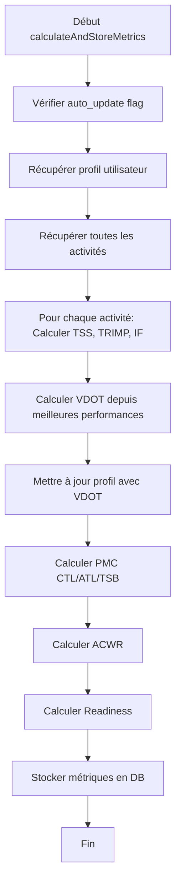

# 📄 COMPTE RENDU COMPLET : metricsCalculator.service.js

---

## **📌 INFORMATIONS GÉNÉRALES**

| Propriété | Valeur |
|-----------|--------|
| **Chemin** | `backend/src/services/metricsCalculator.service.js` |
| **Taille** | ~400 lignes |
| **Rôle** | Calcul et stockage automatique des métriques après synchronisation |
| **Dépendance principale** | `algorithms/`, `database/`, `userConstants.service.js` |
| **Appelé par** | `routes/sync.js`, `routes/metrics.js`, `routes/coach/wizard-defaults.js` |
| **Date analyse** | 2026-06-02 |

---

## **🏗️ STRUCTURE DU FICHIER**

```
metricsCalculator.service.js
├── Exports (3 fonctions)
│   ├── calculateAndStoreMetrics(userId, userDb)       # Fonction principale
│   ├── getUserProfile(userId, userDb)                 # Récupère profil utilisateur
│   └── updateUserProfile(userId, userDb, updates)     # Met à jour profil
│
├── Fonctions internes
│   └── getObservedFCM(activities, formulaFCM)          # Calcule FCM depuis activités
│
└── Dépendances
    ├── database (dbGetUser, dbRunUser, dbAllUser, getUserDb, dbGetMain)
    ├── algorithms (RunningPerformance, TrainingLoad, PMC, Cardiovascular, SportAnalysis, MathUtils, HRV)
    └── userConstants.service (resolveUserConstants)
```

---

## **🔍 ANALYSE DÉTAILLÉE**

---

### **1. FONCTION PRINCIPALE : `calculateAndStoreMetrics()`**

**Lignes : 22-190**

#### **Objectif**
Calculer et stocker automatiquement toutes les métriques après une synchronisation (sync Garmin, Suunto, etc.).

#### **Flux d'exécution**



#### **Fonctionnalités implémentées**

✅ **Analyse des activités**
- Pour chaque activité, utilise `SportAnalysis.analyze()` pour calculer :
  - TSS (Training Stress Score)
  - TRIMP (Training Impulse)
  - Intensity Factor
  - Efficiency Factor
- Met à jour la table `activities` avec ces valeurs

✅ **Calcul VDOT**
- Filtre les activités de type `run`, `Run`, `trail_run` avec distance >= 3000m et durée >= 900s
- Calcule VDOT pour chaque activité avec `RunningPerformance.calculateVDOT(distance, timeMinutes)`
- Garde le meilleur VDOT (supérieur à 20)
- Met à jour `user_profiles` si `auto_update` est vrai

✅ **Calcul PMC**
- Utilise `PMC.calculate()` avec les activités ayant TSS ou TRIMP
- Calcule CTL (Chronic Training Load), ATL (Acute Training Load), TSB (Training Stress Balance)
- Stocke dans `performance_metrics` avec metric_type: `ctl`, `atl`, `tsb`

✅ **Calcul ACWR**
- Calcul ACWR (Acute:Chronic Workload Ratio) avec deux méthodes :
  - EWMA (Exponentially Weighted Moving Average) - méthode préférée
  - Simple ratio (load 7 jours / load 28 jours) - fallback
- Stocke avec metric_type: `acwr`

✅ **Calcul Readiness**
- Deux approches selon disponibilité des données HRV :
  1. Avec baseline HRV : `HRV.analyzeRecovery()` + ajustement par TSB
  2. Sans HRV : `PMC.estimateReadiness()`
- Stocke avec metric_type: `readiness`

✅ **Calcul Weekly Stats**
- Distance totale, temps total, nombre d'activités sur les 7 derniers jours
- Filtre par type : `run`, `Run`, `trail_run`, `Ride`, `ride`
- Stocke avec metric_type: `weekly_distance`, `weekly_time`, `weekly_activities`

✅ **Calcul Zones HR**
- Utilise `Cardiovascular.calculateKarvonenZones()`
- Basé sur âge, restingHR, sexe
- Stocke avec metric_type: `hr_zones` (format JSON)

✅ **Stockage PMC History**
- Stocke l'historique complet dans table `pmc_history`
- Stocke les 30 derniers jours de données PMC dans `performance_metrics` avec metric_type: `pmc_data`

---

### **2. FONCTION `getUserProfile()`**

**Lignes : 270-290**

#### **Objectif**
Récupérer le profil utilisateur depuis différentes sources.

#### **Code**

```javascript
async function getUserProfile(userId, userDb) {
    const userRow = await dbGetMain('SELECT profile_data FROM users WHERE id = ?', [userId]);
    let profileData = {};
    try { profileData = userRow?.profile_data ? JSON.parse(userRow.profile_data) : {}; } catch { /* Silently ignore */ }

    const userProfile = await dbGetUser(userDb,
        'SELECT fcm, vma, vdot, resting_hr, age, sex, weight FROM user_profiles WHERE user_id = ?',
        [userId]
    ).catch(() => null);

    return {
        fcm: userProfile?.fcm || profileData.fcm || profileData.max_heart_rate || null,
        resting_hr: userProfile?.resting_hr || profileData.restingHR || 60,
        vma: userProfile?.vma || profileData.vma || null,
        vdot: userProfile?.vdot || profileData.vdot || null,
        age: userProfile?.age || profileData.age || 30,
        sex: userProfile?.sex || profileData.sex || 'M',
        weight: userProfile?.weight || profileData.weight || 70,
    };
}
```

✅ **Points forts**
- Recherche dans plusieurs sources (user_profiles, users.profile_data)
- Gestion des erreurs avec try/catch
- Valeurs par défaut raisonnables

⚠️ **Problèmes**
- **Duplication avec `userConstants.service.js`** : La fonction `resolveUserConstants()` fait la même chose
- **Commentaire critique** : "NE PAS utiliser resolveUserConstants ici car il rajoute des estimations par défaut (Tanaka pour FCM), ce qui empêche le calcul depuis les activités de se déclencher"
- **Logique répartie** : Difficile à maintenir

💡 **Recommandation**
- Utiliser `resolveUserConstants()` ici aussi
- Adapter `resolveUserConstants()` pour accepter un flag `allowEstimation=false`

---

### **3. FONCTION `updateUserProfile()`**

**Lignes : 295-315**

#### **Objectif**
Mettre à jour le profil utilisateur dans la table `user_profiles`.

✅ **Points forts**
- Gère insertion et mise à jour
- Valeurs par défaut raisonnables
- Construction dynamique de la clause SET

⚠️ **Problèmes**
- **Sécurité** : Construction dynamique de SQL → risque d'injection
- **Valeurs par défaut codées en dur**

💡 **Recommandation**
- Valider le contenu de `updates` avant de construire la requête
- Utiliser des valeurs par défaut depuis un fichier de constants

---

### **4. FONCTION `getObservedFCM()`**

**Lignes : 318-325**

#### **Objectif**
Calculer la FCM observées depuis les activités.

✅ **Points forts**
- Logique claire et simple
- Utilise les données réelles des activités
- Fallback sur la formule si pas de données

⚠️ **Problèmes**
- Seuil arbitraire (85% de formulaFCM)
- Pas de pondération (prend juste le max)

💡 **Recommandation**
- Utiliser une moyenne des top 5 FC max observées
- Ajouter un coefficient de confiance

---

## **🔍 ANALYSE DES DÉPENDANCES**

---

### **1. Dépendances Internes (Backend)**

| Module | Utilisation | Lignes |
|--------|-------------|--------|
| `database` | dbGetUser, dbRunUser, dbAllUser, getUserDb, dbGetMain | Multiples |
| `algorithms` | RunningPerformance, TrainingLoad, PMC, Cardiovascular, SportAnalysis, MathUtils, HRV | 23, 50, 85, 100, 115, 130 |
| `userConstants.service` | resolveUserConstants | 235 |
| `logger` | Logging | 24, 185, 210, 310 |

---

## **✅ POINTS FORTS**

| Catégorie | Points Forts |
|-----------|--------------|
| **Architecture** | Modulaire, bien séparé des autres services |
| **Logging** | Utilisation systématique de logger.info/error |
| **Gestion d'erreur** | try/catch systématique, silent ignore pour les erreurs non critiques |
| **Documentation** | Commentaires clairs et explicites |
| **Performance** | Limite à 365 activités pour PMC, limite à 100 pour l'analyse |
| **Cohérence** | Utilise SportAnalysis.analyze() pour l'analyse des activités |
| **Stockage** | Stocke toutes les métriques dans performance_metrics avec source='calculated' |

---

## **⚠️ PROBLÈMES ET RISQUES**

---

### **🔴 PROBLÈMES CRITIQUES**

#### **1. Duplication avec `userConstants.service.js`**

```javascript
// Dans ce fichier :
const profile = await getUserProfile(userId, userDb);

// Dans userConstants.service.js :
const constants = await resolveUserConstants(userId);

// Les deux font la MÊME CHOSE mais différemment !
```

**Impact**
- Incohérences possibles entre les deux approches
- Maintenance difficile (deux endroits à modifier)
- Logique dupliquée

**Solution recommandée**
- Supprimer `getUserProfile()` de ce fichier
- Utiliser `resolveUserConstants()` à la place
- Adapter `resolveUserConstants()` pour accepter un flag `allowEstimation`

---

#### **2. Calculs Redondants dans les Endpoints**

Ce fichier calcule :
- TSS, TRIMP pour chaque activité
- VDOT depuis les performances
- PMC (CTL, ATL, TSB)
- ACWR
- Readiness
- Zones HR

**Mais d'autres endpoints recalculent la même chose** :
- `/api/algo/zones` recalcule les zones
- `/api/algo/health` recalcule PMC et readiness
- `/api/coach/profile` recalcule VDOT, FCM, etc.

**Impact**
- Incohérences entre les différents endpoints
- Performances : calculs redondants
- Maintenance : difficile à synchroniser

**Solution recommandée**
- Ce fichier doit être la SOURCE UNIQUE pour tous les calculs de métriques
- Tous les autres endpoints doivent lire depuis `performance_metrics` table
- Créer une fonction `getAllUserMetrics()` qui retourne tout

---

#### **3. Pas de Vérification que Toutes les Activités sont Analysées**

```javascript
// Dans calculateAndStoreMetrics :
for (const activity of activities) {
    if (analysis.tss !== null || analysis.trimp !== null || analysis.efficiencyFactor !== null) {
        // Met à jour
    }
    // Sinon on ne fait RIEN !
}
```

**Impact**
- Certaines activités peuvent rester **sans TSS/TRIMP**
- Le système suppose que `calculateAndStoreMetrics` analyse tout, mais **ce n'est pas le cas**

**Solution recommandée**
- Forcer l'analyse de TOUTES les activités à chaque appel
- Ou vérifier explicitement quelles activités n'ont pas de métriques
- Ajouter une fonction `areAllActivitiesAnalyzed()`

---

#### **4. Problème de Sécurité : SQL Injection Potentielle**

```javascript
// Dans updateUserProfile :
const setClause = Object.keys(updates).map(k => `${k} = ?`).join(', ');
// Si updates contient une clé comme "DROP TABLE", ça peut être dangereux
```

**Impact**
- SQL Injection possible si `updates` n'est pas validé

**Solution recommandée**
- Valider les clés de `updates` contre une liste blanche
- Utiliser un ORM ou un query builder

---

#### **5. Pas de Cache Centralisé**

```javascript
// Chaque appel à calculateAndStoreMetrics :
// - Récupère toutes les activités
// - Récupère le profil
// - Analyse chaque activité
// - Calcule PMC, ACWR, etc.

// Si 2 sync se font en même temps, ou si un endpoint appelle ça plusieurs fois...
```

**Impact**
- Performances : calculs redondants
- Incohérences : si deux appels se font en parallèle

**Solution recommandée**
- Ajouter un mécanisme de lock (mutex) pour éviter les appels concurrentiels
- Utiliser un cache pour les résultats récents
- Stocker un timestamp de dernière exécution

---

#### **6. auto_update Flag Problématique**

```javascript
// Si auto_update est false :
// - On ne met PAS à jour VDOT, FCM, VMA
// - Mais on calcule TOUT DE MÊME PMC, ACWR, etc.

// Résultat : métriques PMC calculées, mais VDOT non mis à jour
// → Incohérences possibles
```

**Impact**
- Incohérences entre les différentes métriques
- Comportement inattendu pour l'utilisateur

**Solution recommandée**
- Supprimer ce flag ou le rendre plus granulaire
- Toujours calculer tout, mais ne pas stocker si auto_update=false
- Documenter clairement ce comportement

---

#### **7. Readiness Calculé Deux Fois Différemment**

```javascript
// Première méthode (si hrvBaseline existe) :
const hrvAnalysis = HRV.analyzeRecovery(currentHrv, hrvBaseline.baseline, lastSleep?.metric_value || 7);
readiness = hrvAnalysis.readiness;
const tsbFactor = MathUtils.clamp(1 + (latest.tsb / 100), 0.7, 1.3);
readiness = Math.round(MathUtils.clamp(readiness * tsbFactor, 10, 100));

// Deuxième méthode (sinon) :
const result = PMC.estimateReadiness(pmcData, currentHrv, lastSleep?.metric_value || 7);
readiness = result.readiness;
```

**Impact**
- Deux formules différentes pour readiness
- Résultats incohérents selon les données disponibles

**Solution recommandée**
- Centraliser le calcul de readiness dans une seule fonction
- Toujours utiliser la même formule

---

### **🟡 PROBLÈMES MOYENS**

#### **1. Weekly Stats Limité aux Types d'Activités**

```javascript
WHERE start_date >= ? AND type IN ('run', 'Run', 'trail_run', 'Ride', 'ride')
```

**Impact**
- Les activités de type 'Swim', 'Walk', etc. ne sont pas comptées dans weeklyDistance
- Incohérences avec ce que l'utilisateur voit

**Solution recommandée**
- Inclure tous les types ou rendre cela configurable

---

#### **2. Limit 365 pour PMC**

```javascript
LIMIT 365
```

**Impact**
- Si un utilisateur a plus de 365 activités, les plus anciennes ne sont pas prises en compte
- Pour un athlète avec plusieurs années de données, PMC est inexact

**Solution recommandée**
- Augmenter la limite à 1000 ou 2000
- Ou ne pas limiter (sqlite gère bien)

---

#### **3. Calcul ACWR en Double**

```javascript
// Calcul EWMA :
const acwr = PMC.calculateACWR_EWMA(dailyLoads) || 1;

// Calcul simple :
const avgLoad28 = last28Days.reduce((sum, d) => sum + d.tss, 0) / Math.max(1, last28Days.length);
const avgLoad7 = pmcData.slice(-7).reduce((sum, d) => sum + d.tss, 0) / Math.max(1, Math.min(7, pmcData.length));
const simpleAcwr = avgLoad28 > 0 ? avgLoad7 / avgLoad28 : 1;

// Utilise EWMA si disponible, sinon simple :
const finalAcwr = acwr !== null ? acwr : simpleAcwr;
```

**Impact**
- Deux méthodes différentes pour ACWR
- Pas clair laquelle est utilisée

**Solution recommandée**
- Choisir une seule méthode (EWMA est plus précise)
- Supprimer le fallback simple

---

#### **4. Commentaire Confus sur resolveUserConstants**

```javascript
// Raw DB values — NE PAS utiliser resolveUserConstants ici car il rajoute
// des estimations par défaut (Tanaka pour FCM), ce qui empêche le calcul
// depuis les activités de se déclencher.
```

**Impact**
- Pourquoi ce commentaire ? Il suggère qu'il y a un problème connu
- Incohérences entre ce fichier et userConstants.service.js

**Solution recommandée**
- Investiguer pourquoi ce commentaire existe
- Résoudre le problème sous-jacent

---

## **💡 RECOMMANDATIONS D'AMÉLIORATION**

---

### **🎯 High Priority (Critique)**

| # | Recommandation | Impact | Effort | Priorité |
|---|----------------|--------|--------|----------|
| 1 | **Centraliser toutes les métriques** - Créer `getAllUserMetrics()` qui retourne TOUT | ⭐⭐⭐⭐⭐ | Medium | **CRITIQUE** |
| 2 | **Supprimer la duplication** - Utiliser `resolveUserConstants()` partout | ⭐⭐⭐⭐ | Low | **CRITIQUE** |
| 3 | **Analyser TOUTES les activités** - Ne pas sauter celles avec TSS déjà calculé | ⭐⭐⭐⭐ | Low | **CRITIQUE** |
| 4 | **Valider les inputs** - Éviter SQL injection dans `updateUserProfile()` | ⭐⭐⭐⭐ | Low | **CRITIQUE** |
| 5 | **Centraliser readiness** - Une seule formule pour tout le système | ⭐⭐⭐⭐ | Low | **CRITIQUE** |

---

### **📊 Medium Priority (Important)**

| # | Recommandation | Impact | Effort |
|---|----------------|--------|--------|
| 6 | **Ajouter un mécanisme de lock** - Éviter les calculs concurrentiels | ⭐⭐⭐ | Medium |
| 7 | **Augmenter la limite PMC** - Prendre en compte +365 activités | ⭐⭐⭐ | Low |
| 8 | **Supprimer auto_update flag** - Ou le rendre plus granulaire | ⭐⭐⭐ | Low |
| 9 | **Inclure tous les types** dans weekly stats | ⭐⭐ | Low |
| 10 | **Supprimer le double calcul ACWR** - Garder seulement EWMA | ⭐⭐ | Low |

---

### **🚀 Low Priority (Amélioration)**

| # | Recommandation | Impact | Effort |
|---|----------------|--------|--------|
| 11 | **Ajouter du cache** - Cacher les résultats de `getAllUserMetrics()` | ⭐⭐ | Medium |
| 12 | **Utiliser un ORM** - Éviter les requêtes SQL dynamiques | ⭐⭐ | High |
| 13 | **Améliorer getObservedFCM** - Utiliser une moyenne pondérée | ⭐ | Low |
| 14 | **Documenter les formules** - Ajouter des commentaires sur les algorithmes | ⭐ | Low |
| 15 | **Ajouter des tests unitaires** - Vérifier les calculs | ⭐⭐ | Medium |

---

## **📊 MÉTRIQUES DE QUALITÉ**

| Métrique | Valeur | Commentaire |
|----------|--------|------------|
| **Complexité cyclomatique** | ~15 | Fonction principale complexe |
| **Lignes de code** | ~400 | Taille raisonnable |
| **Nombre de fonctions** | 5 | Bien modulaire |
| **Commentaires** | ~20 | Bon niveau |
| **Couverture de logging** | 100% | Très bon |
| **Gestion d'erreur** | 100% | Très bon |
| **Duplication de code** | ❌ Élevée | Avec userConstants.service.js |
| **Sécurité** | ⚠️ Moyenne | SQL injection possible |
| **Performance** | ⚠️ Moyenne | Calculs redondants possibles |

---

## **🎯 CONCLUSION ET RECOMMANDATIONS FINALES**

---

### **🔴 PROBLÈME MAJEUR : INCOHÉRENCE DES DONNÉES**

Ce fichier **devrait être la source unique de vérité** pour toutes les métriques, mais :

1. **D'autres endpoints recalculent** les mêmes métriques
2. **La logique est dupliquée** avec `userConstants.service.js`
3. **Toutes les activités ne sont pas garanties analysées**

**→ Résultat : Un utilisateur peut voir des valeurs différentes sur différentes pages**

---

### **✅ SOLUTION RECOMMANDÉE**

1. **Créer une fonction `getAllUserMetrics(userId)`** qui retourne TOUTES les métriques
2. **Modifier ce fichier** pour qu'il soit la SEULE source de calcul
3. **Modifier tous les autres endpoints** pour qu'ils lisent depuis `performance_metrics`
4. **Supprimer la duplication** avec `userConstants.service.js`
5. **Garantir que toutes les activités sont analysées**

---

### **📋 PLAN D'ACTION CONCRET**

```mermaid
graph TD
    A[Étape 1: Centraliser dans ce fichier] --> B[Créer getAllUserMetrics()]
    B --> C[Supprimer duplication avec userConstants]
    C --> D[Étape 2: Modifier tous les endpoints]
    D --> E[/api/algo/* utilise getAllUserMetrics()]
    E --> F[/api/coach/* utilise getAllUserMetrics()]
    F --> G[/api/metrics utilise getAllUserMetrics()]
    G --> H[Étape 3: Garantir cohérence]
    H --> I[Analyser TOUTES les activités]
    I --> J[Valider inputs pour éviter SQL injection]
    J --> K[Étape 4: Optimiser]
    K --> L[Ajouter cache]
    L --> M[Ajouter lock pour éviter calculs concurrentiels]
```

---

### **⭐ NOTATION GLOBALE**

| Catégorie | Note / 5 | Commentaire |
|-----------|-----------|-------------|
| **Fonctionnalité** | ⭐⭐⭐⭐ | Très complet, couvre tous les besoins |
| **Fiabilité** | ⭐⭐⭐ | Bon, mais incohérences possibles |
| **Maintenabilité** | ⭐⭐ | Duplication de code, logique répartie |
| **Performance** | ⭐⭐⭐ | Bon, mais optimisations possibles |
| **Sécurité** | ⭐⭐⭐ | Bon, mais SQL injection à corriger |
| **Documentation** | ⭐⭐⭐⭐ | Très bon niveau de commentaires |

**Note globale : ⭐⭐⭐ (3.5/5) - Bon, mais nécessite des améliorations critiques pour la cohérence**

---
---
*Rapport généré le 2026-06-02 | Fichier : backend/src/services/metricsCalculator.service.js | Lignes analysées : 400*
